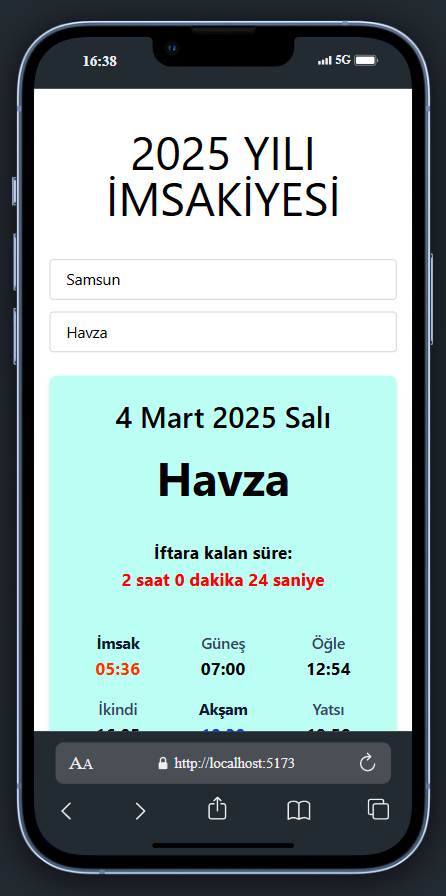
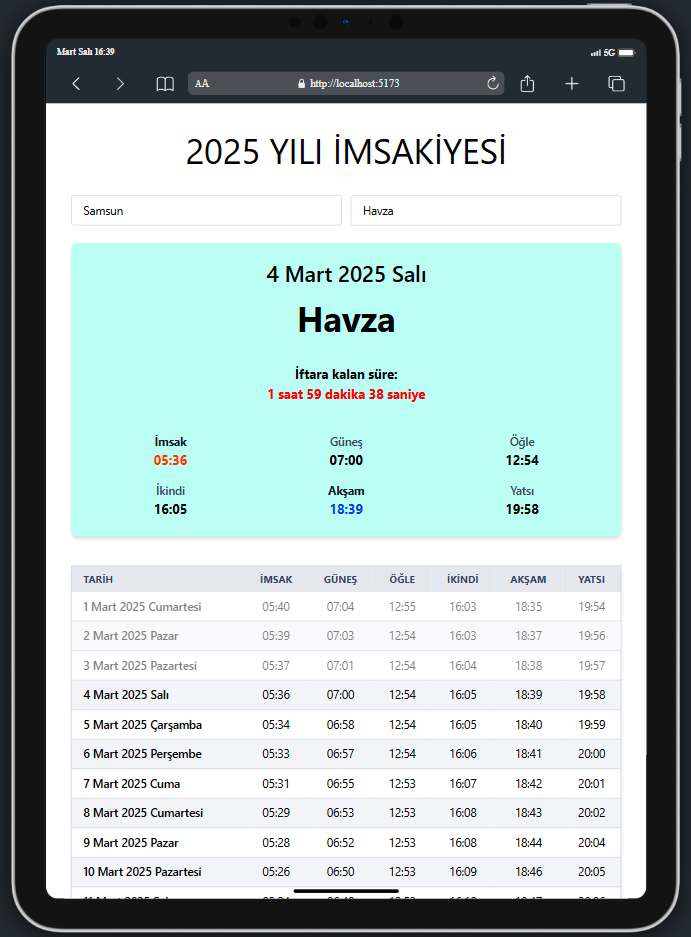
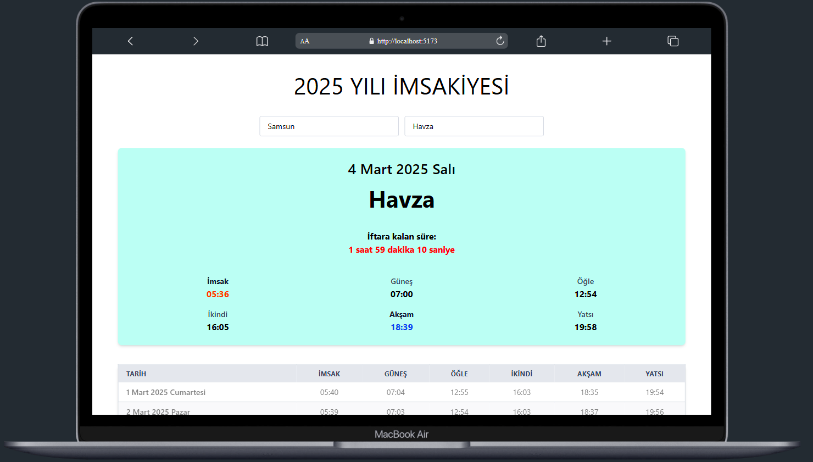

# 🕌 2025 İmsakiye Uygulaması  

Bu proje, kullanıcıların seçtiği **şehir** ve **ilçeye** göre **imsakiyeyi** görüntülemelerini sağlar.  
İftar ve imsak vakitlerine kalan süre **canlı olarak** güncellenir.  
Mobil ve masaüstü uyumlu, **responsive** bir tasarıma sahiptir.  

---

## 🚀 Özellikler  

✅ **Şehir ve ilçe seçimi** (Dropdown ile)  
✅ **Günlük namaz vakitleri** (Tarih, imsak, güneş, öğle, ikindi, akşam, yatsı)  
✅ **İftara & imsak'a kalan süre** (Canlı sayaç)  
✅ **Geçmiş günler opaklığı azaltılmış**  
✅ **Mobilde kart görünümü, masaüstünde tablo görünümü**  
✅ **Dropdown menüler dışarıya tıklanınca kapanır**  

---

## 📌 Kullanılan Teknolojiler  

- **React 19**  
- **Tailwind CSS**  
- **fetch API** (Namaz vakitlerini almak için)  
- **useState, useEffect, useRef**  

---

## 📂 Proje Yapısı 
```sh

📦 src
 ┣ 📂 components
 ┃ ┣ 📜 Cities.jsx       
 ┃ ┣ 📜 Districts.jsx   
 ┃ ┣ 📜 Table.jsx        
 ┃ ┣ 📜 TodayTimes.jsx   
 ┣ 📜 App.jsx            
 ┣ 📜 index.css         
 ┗ 📜 main.jsx           
```

## 📸 Ekran Görüntüleri 

<div align="center">
  
  
  
</div>